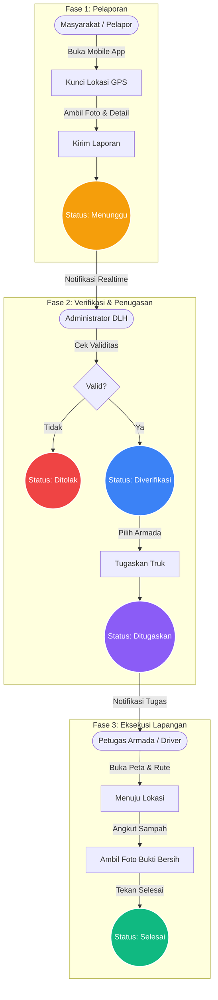
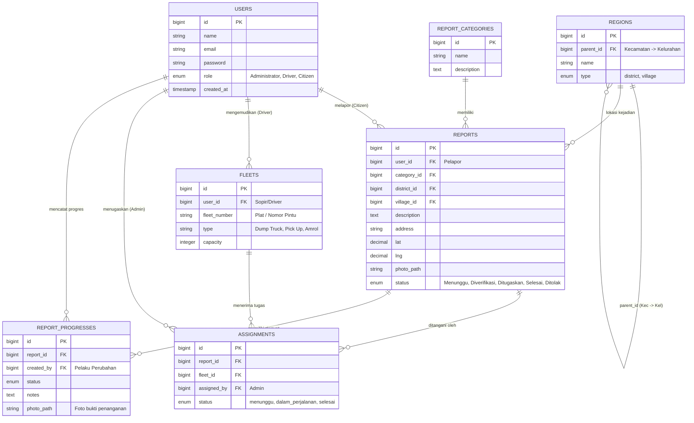

# Panduan Pengguna & Alur Sistem Ternate Bersih

Dokumen ini berisi panduan penggunaan sistem **Ternate Bersih (SIPAS Ternate)**, platform pelaporan tumpukan sampah berbasis geolokasi untuk menjembatani masyarakat Kota Ternate dengan Dinas Lingkungan Hidup (DLH).

## 1. Flowchart Sistem

Berikut adalah representasi visual dari alur kerja (workflow) laporan sampah dari awal hingga selesai:

---

## 2. Alur Kerja (Workflow) Detail

### Langkah 1: Masyarakat Melapor (Mobile)
Masyarakat yang menemukan tumpukan sampah liar membuka aplikasi mobile Ternate Bersih.
1. Menekan tombol **Lapor**.
2. Mengambil foto bukti tumpukan sampah.
3. Menekan tombol **"Kunci Lokasi (GPS)"**. Sistem akan otomatis mendeteksi koordinat dan mengubahnya menjadi alamat (Jalan, Kelurahan, Kecamatan).
4. Mengisi catatan tambahan dan memilih Kategori Laporan.
5. Menekan **Kirim Laporan**. Status awal adalah **Menunggu Verifikasi**. 
> [!NOTE]
> Pada tahap ini, masyarakat masih memiliki tombol "Hapus Laporan" jika mereka berubah pikiran atau salah melapor.

### Langkah 2: Verifikasi Admin (Web)
Laporan masuk ke Dashboard Web Administrator DLH.
1. Admin menerima indikator Lonceng Notifikasi secara realtime.
2. Admin mengecek validitas foto dan kejelasan lokasi.
3. Jika laporan dianggap tidak relevan (iseng), Admin berhak mengubah status menjadi **Ditolak**.
4. Jika valid, Admin menyetujui dan mengubah status menjadi **Diverifikasi**.
> [!IMPORTANT]
> Setelah status Diverifikasi, pelapor asli (masyarakat) sudah tidak bisa lagi menghapus laporan tersebut dari aplikasi mobile mereka.

### Langkah 3: Penugasan Armada (Web)
Setelah laporan diverifikasi, sampah harus segera diangkut.
1. Admin menekan tombol **"Tugaskan Armada"**.
2. Admin melihat daftar Truk/Driver yang berstatus aktif.
3. Admin memilih Driver yang dituju.
4. Status berubah menjadi **Ditugaskan** dan Driver yang bersangkutan mendapat notifikasi.

### Langkah 4: Penyelesaian Laporan (Mobile - Driver)
Driver yang sedang bertugas membuka aplikasi mobile mereka.
1. Driver melihat tugas baru di tab **Peta & Tugas**.
2. Driver mengikuti panduan Peta (G-Maps/OpenStreetMap) menuju titik koordinat.
3. Setelah sampai dan sampah selesai diangkut, Driver membuka **Detail Tugas**.
4. Driver wajib mengambil **Foto Bukti Bersih** di lokasi.
5. Menekan tombol **Selesaikan Tugas**. Status laporan secara permanen menjadi **Selesai**.

---

## 3. Panduan Fungsional Administrator

Sistem ini didesain sebagai **Closed System** (Sistem Tertutup) demi keamanan. Hal ini berarti pendaftaran publik secara terbuka dinonaktifkan.

### Manajemen Pengguna
Karena tidak ada halaman "Daftar" (Register), Admin memiliki kewajiban mutlak:
* Membuatkan akun secara manual untuk setiap Petugas Armada (Driver).
* Membuatkan akun untuk Operator atau Staf DLH lainnya.
* Menjaga kerahasiaan kata sandi bawaan (default) yang diberikan kepada Driver sebelum mereka bisa mengubahnya.

### Manajemen Master Data (Wilayah & Kategori)
Aplikasi Mobile sangat bergantung pada data yang dikendalikan oleh Web Backend:
* Admin harus memastikan ketersediaan data **Kecamatan** dan **Kelurahan**.
* Jika kelurahan tempat masyarakat melapor tidak ada dalam database, form aplikasi mobile akan *error*. Selalu mutakhirkan master data.

### Pemantauan (Dispatching)
Admin DLH berfungsi layaknya seorang *Dispatcher*.
* Selalu perhatikan ikon Lonceng Notifikasi di pojok kanan atas Dashboard.
* Jangan biarkan laporan menumpuk di status "Menunggu Verifikasi" atau "Diverifikasi". Semakin cepat Armada ditugaskan, semakin efisien penanganan sampah di kota Ternate.

### Ekspor Data Laporan
Sistem menyimpan rekam jejak setiap laporan.
* Gunakan menu **Ekspor Data** untuk mengunduh seluruh aktivitas harian, bulanan, maupun tahunan.
* File format Excel ini dapat digunakan sebagai laporan resmi pertanggungjawaban DLH.

---

## 4. Desain Database & Relasi (ERD)

Sistem Ternate Bersih didukung oleh arsitektur database relasional untuk menjaga integritas data pelaporan, wilayah, hingga penugasan armada. Berikut adalah diagram entitas beserta kardinalitas relasinya:

### Penjelasan Relasi Utama:
1. **Users & Reports (1:N)**: Satu pengguna (Masyarakat) dapat membuat banyak laporan pengaduan sampah.
2. **Users & Fleets (1:N)**: Satu pengguna (Driver) mengemudikan satu armada secara spesifik (atau bergantian).
3. **Reports & Progresses (1:N)**: Satu laporan memiliki banyak tahapan (riwayat waktu pelaporan, kapan diverifikasi, dan kapan selesai ditangani). 
4. **Reports & Assignments (1:N/1:1)**: Satu laporan yang valid ditugaskan kepada suatu Armada melalui tabel *Assignments* sebagai bukti administratif.
5. **Regions Hierarchy (1:N)**: Tabel region merelasikan dirinya sendiri di mana satu *District* (Kecamatan) memiliki banyak *Village* (Kelurahan).

